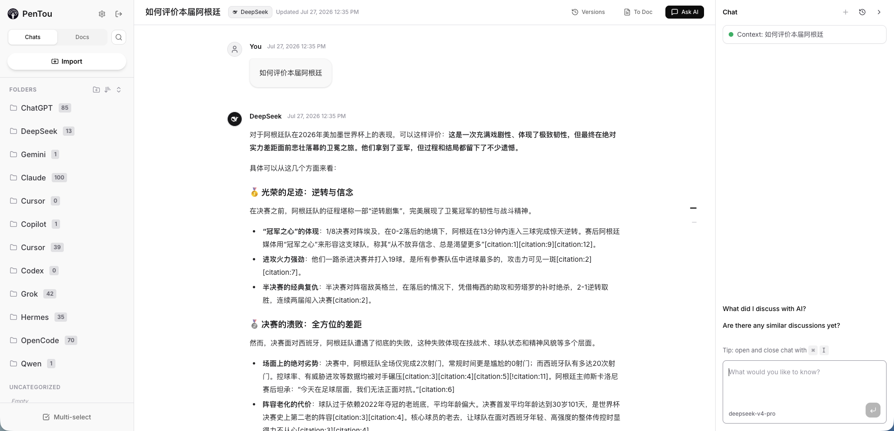
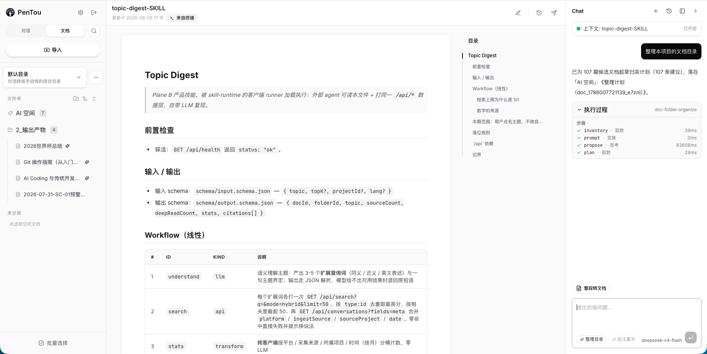

<div align="center">

<picture>
  <source media="(prefers-color-scheme: dark)" srcset="./assets/images/logo_dark.png">
  
</picture>

# PenTou

**The palest ink beats the best memory.**

Whatever you worked out with an AI is gone the moment you close the tab.<br>
PenTou pulls those conversations off a dozen platforms onto your own machine, as Markdown that stays **searchable, editable, and portable**.

[简体中文](./README.md) | English

[](./LICENSE)
[](https://www.npmjs.com/package/@startist/pentou)


</div>



<sub>The three-pane window (shown with the Chinese UI): platform folders with counts · conversation body · a docked AI panel. Here it's running “Digest topic” — name a subject and it searches the whole library, reads the closest hits, and writes a digest into the AI workspace, with every step and its timing laid out</sub>

---

## Who it's for

- Heavy users working across several AI products daily who need **one place to keep and re-find** everything
- **Knowledge workers** turning conversations into articles, proposals and notes
- Developers running Claude Code / Cursor / Codex who want sessions **archived automatically**
- Privacy-minded people who insist on owning their data rather than renting it from a cloud
- Anyone already living in an Obsidian / Markdown / Git workflow

---

## Why it's worth using now

**Status: ready for daily use.** One command gets it running on your machine. Capture, search, distillation into documents, AI rework, and self-hosted deployment form a complete loop — this is a workbench you can use every day, not a demo.

| Pain point | What PenTou does |
| --- | --- |
| Conversations scattered across a dozen platforms | **One inbox**: export files, share links, automatic CLI capture, browser extension (now on the Chrome Web Store) |
| Project Markdown also needs a home | **CLI document push**: lands under a git-repo **project**, with optional always-on `watch` |
| You know you discussed it, but can't find it | **Local full-text plus optional semantic search**, jump-and-highlight across conversations and documents |
| After import, you can't tell where it came from | **Top-bar attribution badges**: capture method (Web / Terminal / Manual), project, document origin |
| Hundreds of threads piled up, nobody to sort them | **AI skills**: name a topic and get a library-wide digest; get a filing plan drafted for your whole document tree |
| Long threads never become knowledge | **Conversation → document → annotation → AI rewrite → push to Obsidian** |
| No idea what the AI actually did | **Visible execution traces** and **approve-before-apply plans** — nothing touches your library behind your back |
| Data sits in the cloud and won't come out | **Plain Markdown on disk**, consumable directly by VS Code, Git or Obsidian |
| Deployment is a project in itself | **One `npx` command** locally, or **Docker** for self-hosting, with data portable between instances |

---

## Core capabilities

### 1. Multi-source capture: archived as it happens

- **Manual import**: ChatGPT / DeepSeek JSON exports, assorted `.jsonl` files, Markdown, and platform share links. Drop them in as a batch — one bad file won't sink the rest.
- **CLI collector**: watches desktop agent sessions and reports them automatically, covering Claude Code, Codex, Cursor, Copilot, OpenCode, Hermes, Grok CLI, Pi and more. `pull` for batches, `watch` for incremental updates.
- **Browser extension**: [Pentou Collector](https://chromewebstore.google.com/detail/pentou-collector/kfepbkfbnminfhcenaookdnikccdfmip) is live on the Chrome Web Store — install it, fill in two fields, and it captures ChatGPT / DeepSeek web threads. The extension only does dumb capture; parsing and deduplication happen server-side.
- **Ingest gateway**: idempotent upserts, secret redaction, and automatic slimming of oversized sessions — syncing repeatedly won't litter your library with duplicates.
- **Auto-filing on import**: conversations land in the folder matching their platform, so there's less to tidy by hand.
- **CLI document push**: project Markdown (READMEs, design notes, research) lands in the **document plane** with one command; grouped by a git-repo **project** dimension, with optional `watch` for always-on sync.

Setting up either automatic channel — and excluding the projects you'd rather not upload — is covered in [`docs/auto-collect-guide.md`](./docs/auto-collect-guide.md) (Chinese).
Document push and project grouping: [`docs/cli-doc-push-guide.md`](./docs/cli-doc-push-guide.md) (Chinese).


<sub>One panel for all four channels — platform exports, share links (8 platforms), CLI collector (9 desktop agents), browser extension — each card listing the platforms it supports and the three steps to wire it up</sub>

### 2. Local Markdown as the source of truth

Each conversation is a Markdown file (frontmatter plus message body) under your data directory: `pentou-data/conversations/<id>.md` when launched via npx, `data/conversations/<id>.md` from source or in Docker. The index can be rebuilt at any time; the directory can be put under Git, backed up wholesale, or copied to another machine.

### 3. Search and rework

- **Hybrid search**: SQLite FTS5 full-text by default, plus an optional embedding-based semantic path, fused with RRF ranking.
- **Document loop**: one-click conversion to a document, message excerpts, and MinerU parsing for PDF / Docx / PPTX. Annotations drive AI rewrites, and every version can be rolled back.
- **AI sidebar**: docked on the right, carrying the current conversation or document as context by default (bring your own key); answers can be saved back as documents.
- **Obsidian export**: push finished material into your permanent knowledge base.



<sub>The document view (shown with the Chinese UI): body plus an auto-generated outline, while the AI panel drafts a filing plan for 107 candidate documents into the AI workspace, waiting for you to tick items — the toolbar above holds the rest of the loop: edit, version history, push to Obsidian</sub>

### 4. AI skills: not just answers — it does the work

At the bottom of the sidebar sit a few **intent chips**. One click runs a built-in skill — this is what separates PenTou from “yet another chat box”:

| Skill | What happens when you click it |
| --- | --- |
| **Digest topic** | Name a subject; it expands the query terms → searches the whole library → runs multi-axis stats → deep-reads the closest hits → writes a digest with a clickable source list |
| **Tidy folders** | Detects the project type, compares against a typical folder structure, and drafts a **checkbox filing plan** for the whole library — not one document moves before you approve |
| **To doc** | Turns the current conversation into structured Markdown; re-running it saves a version first, then overwrites, so it stays reversible |
| **Rewrite** | Hands your annotations to the LLM as revision notes and produces a new version for confirmation |

Three design choices make that trustworthy:

- **The trace is open**: every step (understand / search / stats / deep-read / compose / persist) is listed under the answer with its timing, so you can see what ran and how long it took;
- **Writes need approval**: any skill that would change your library drafts a plan first; cleanup moves files into a `_Pending Cleanup` folder — **nothing is ever silently deleted**;
- **Output has a home**: skill results land in the **AI workspace**, never mixed into the material you imported.

Each skill is a plain-text workflow in `data/skills/<name>/SKILL.md` whose runtime dependencies are expressed purely as `/api/*` contracts — you can edit them, and an external agent can read the same file, point at your Pentou instance, and reproduce the same run.

### 5. A product you can actually live in

- Three-pane layout — folder sidebar, conversation/document body, question outline — with light and dark themes in English and Chinese.
- **Source at a glance in the top bar**: conversation headers show brand/form, capture method (Web / Terminal / Manual) and project; document headers show “Updated” plus origin (From Chat / From Terminal / Imported) — so you can tell extension vs CLI, or “pushed from a repo” vs “converted from a chat”, without opening settings.
- **Metadata panel**: a collapsible block at the end of the body, putting fixed fields (platform / capture method / session time / source project / message count …) next to the document's own YAML frontmatter, verbatim and copyable.
- **Plan status bar**: every AI-drafted action plan carries its run state at the top — not run yet / run / interrupted / failed — with the timestamp and how many changes landed, so you never have to guess whether a plan is stale.
- Syntax highlighting, Mermaid diagrams, localized image assets, and a lightbox viewer.
- Settings, import and search all have adapted layouts on desktop **and mobile**.
- The UI runs on a unified design system; batch selection, drag-to-file, and time sorting are all in place.

### 6. Three deployment shapes, with portable data

| Shape | Who it's for | Entry point |
| --- | --- | --- |
| **Local `npx`** | Personal daily use, zero ops | `npx -y @startist/pentou@latest` → [`docs/user-guide.md`](./docs/user-guide.md) |
| **Docker** | Long-running service on a NAS or cloud host | [`docs/deployment.md`](./docs/deployment.md) |
| **From source** | Contributors and forks | [`docs/CONTRIBUTING.md`](./docs/CONTRIBUTING.md) |

Instances support **one-click migration** (push / pull with a diff preview), so moving from a trial to a permanent setup, syncing across machines, or pulling from the cloud back to your laptop never requires copying files by hand. Migration is at R1: it works, but acceptance against two real instances, resume-after-interruption and streaming transfer for large media libraries are still being filled in.

---

## 30 seconds to first run

```bash
# 1. Node.js >= 20 is required
node -v

# 2. Run this in whichever directory should hold your data
npx -y @startist/pentou@latest

# 3. Open the address printed in the terminal (http://127.0.0.1:7766 by default)
# 4. Click Import for your first conversation, or set up automatic capture (docs/auto-collect-guide.md)
```

Data lands in `pentou-data/` in the current directory. It listens on localhost only, so no password is required, and backing up means copying that one folder. Full walkthrough: [`docs/user-guide.md`](./docs/user-guide.md) (in Chinese).

Docker (self-hosted service):

```bash
mkdir -p /srv/pentou/data && chown -R 1000:1000 /srv/pentou/data

docker run -d \
  --name pentou \
  --restart unless-stopped \
  -p 127.0.0.1:7766:7766 \
  -e PENTOU_PASSWORD='your-strong-password' \
  -v /srv/pentou/data:/app/data \
  -m 1g \
  ghcr.io/startppt/pentou:latest
```

The image supports `linux/amd64` and `linux/arm64`. Anything exposed to the internet must terminate TLS at your own reverse proxy — see [`docs/deployment.md`](./docs/deployment.md) for the full story.

---

## Let an AI agent do it for you

You don't need to write a line of code to install this. Paste the prompt below into any AI agent (Claude Code, Cursor, Codex, …) and let it check your environment, work through any errors, start PenTou, and leave a one-click launcher on your desktop:

<details>
<summary>Click to copy the prompt</summary>

```text
Please start Pentou (a local-first AI conversation manager) in the current directory,
and make sure I can start it with one click from now on.

Target command:
npx -y @startist/pentou@latest

Follow these steps strictly:

1. Environment check: confirm node, npm and npx are available, and that node is >= 20.
2. Run the target command. If it fails, do not stop at the error — diagnose and fix it,
   then retry until the command succeeds:
   - Node.js missing or too old: install (or walk me through installing) the LTS release
     for my operating system;
   - Network / registry timeouts: configure a working npm mirror and retry;
   - Permission, cache, PATH or npm config problems: fix them and retry;
   - Re-run the target command after every fix until it works.
3. Success means: the terminal prints an address (like http://127.0.0.1:7766) and that page
   opens in a browser. If the browser does not open by itself, give me the full address.
4. Create a one-click launcher on my desktop for future use:
   - macOS: a double-clickable .command script (remember chmod +x);
   - Windows: a .bat script;
   - Linux: an executable .sh script;
   - The script should cd into the data directory used for this run, then execute
     npx -y @startist/pentou@latest.
5. Actually run that script once to confirm it starts Pentou (you can stop the server after).
6. Finally, tell me in plain language:
   - the address where Pentou is running;
   - which folder holds my data (copying that folder is my backup);
   - the full path of the desktop script, and which file to double-click next time.

Do not install anything unrelated to the goal above, and do not change system configuration
unrelated to Node.js / npm.
```

</details>

Prefer doing it yourself? [`docs/user-guide.md`](./docs/user-guide.md) (Chinese) has the desktop launcher scripts for all three platforms plus an FAQ. To run from source or open a PR, see [`docs/CONTRIBUTING.md`](./docs/CONTRIBUTING.md).

---

## Documentation

| Document | Purpose |
| --- | --- |
| [`docs/pentou-introduction.md`](./docs/pentou-introduction.md) | Product introduction and capabilities (Chinese) |
| [`docs/user-guide.md`](./docs/user-guide.md) | Local `npx` user guide (Chinese) |
| [`docs/auto-collect-guide.md`](./docs/auto-collect-guide.md) | Automatic capture guide — CLI collector + browser extension (Chinese) |
| [`docs/cli-doc-push-guide.md`](./docs/cli-doc-push-guide.md) | Pushing project Markdown into the document plane from the CLI (Chinese) |
| [`docs/agent-skills/README.md`](./docs/agent-skills/README.md) | Agent Skills for end users — setup / collect / docs-push, copy the folder as-is (Chinese) |
| [`docs/releases.md`](./docs/releases.md) | Release notes (Chinese) |
| [`docs/deployment.md`](./docs/deployment.md) | Docker deployment and reverse proxy (Chinese) |
| [`docs/CONTRIBUTING.md`](./docs/CONTRIBUTING.md) | Contribution guide |
| [`docs/SECURITY.md`](./docs/SECURITY.md) | Security policy and vulnerability reporting |

---

## Acknowledgements

Thanks to [LINUX DO](https://linux.do/) — a sincere, friendly, united and professional tech community. Quite a few problems hit while building PenTou were solved by digging through threads there.

---

## License

[MIT](./LICENSE) © 2026 STArtppt

---

<div align="center">

**PenTou — stop fragmenting your conversations, start building your own AI knowledge base.**

</div>
